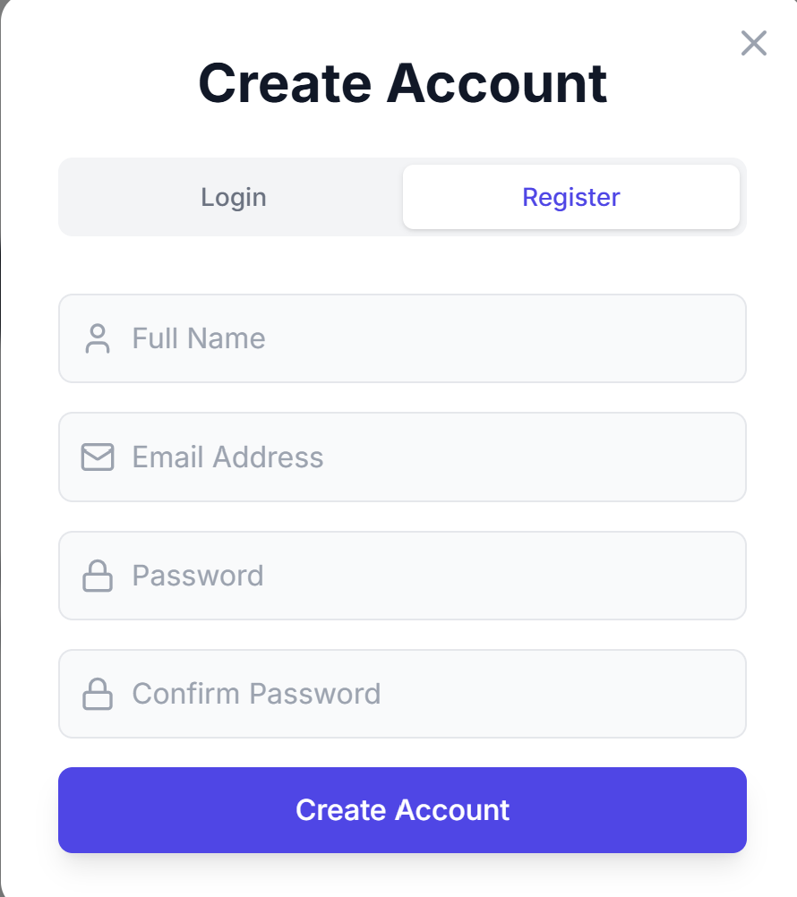
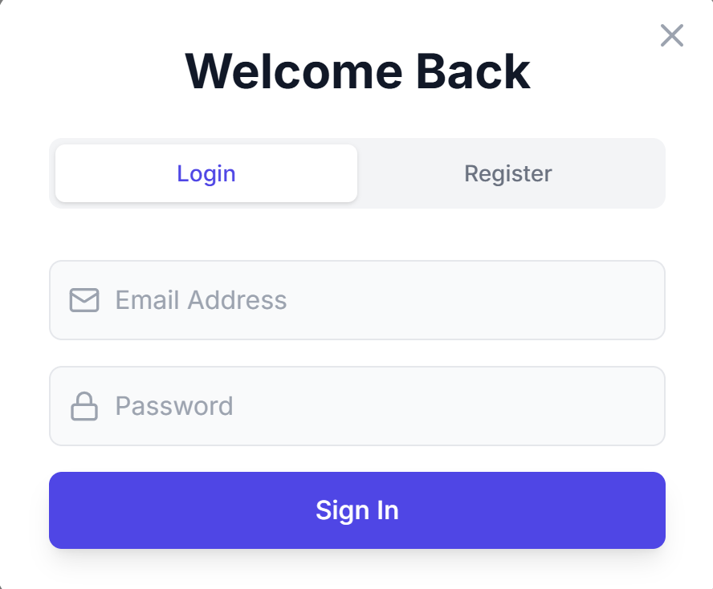
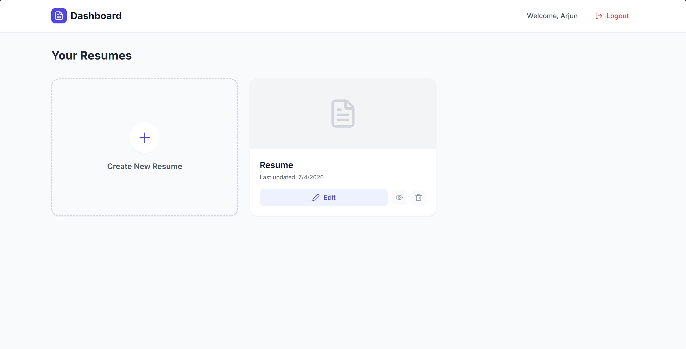
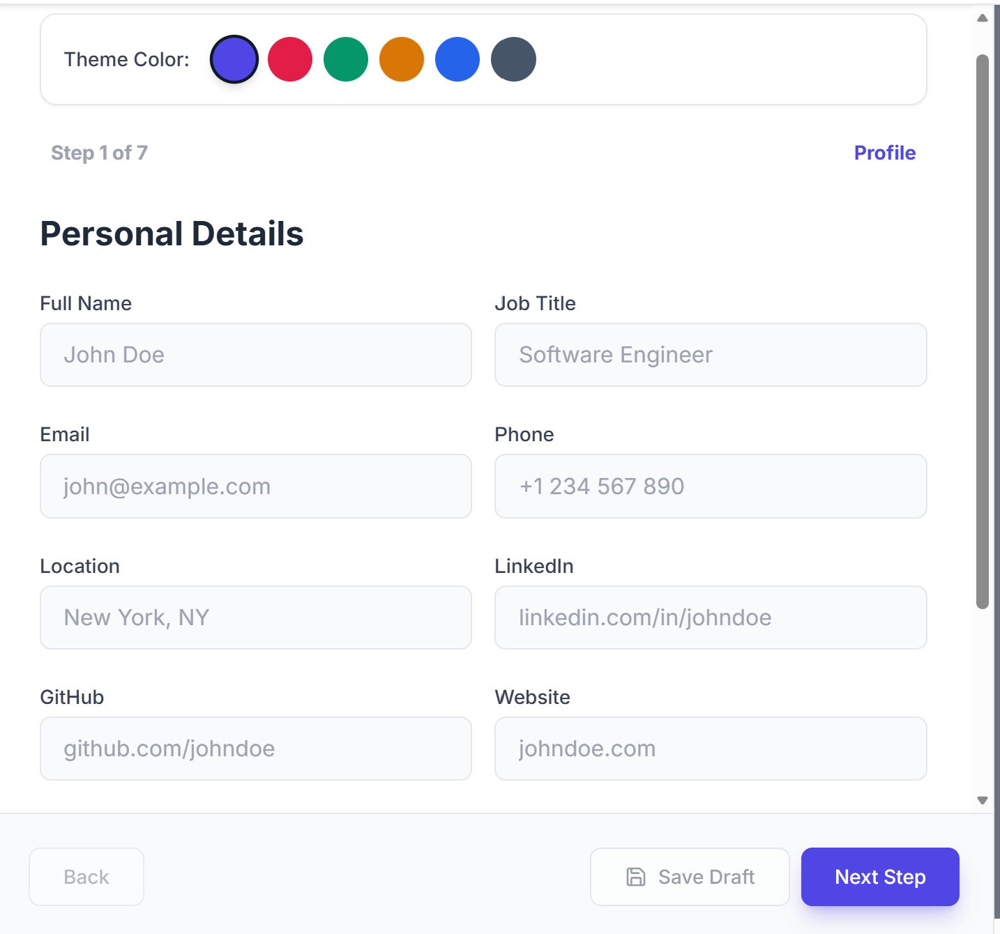
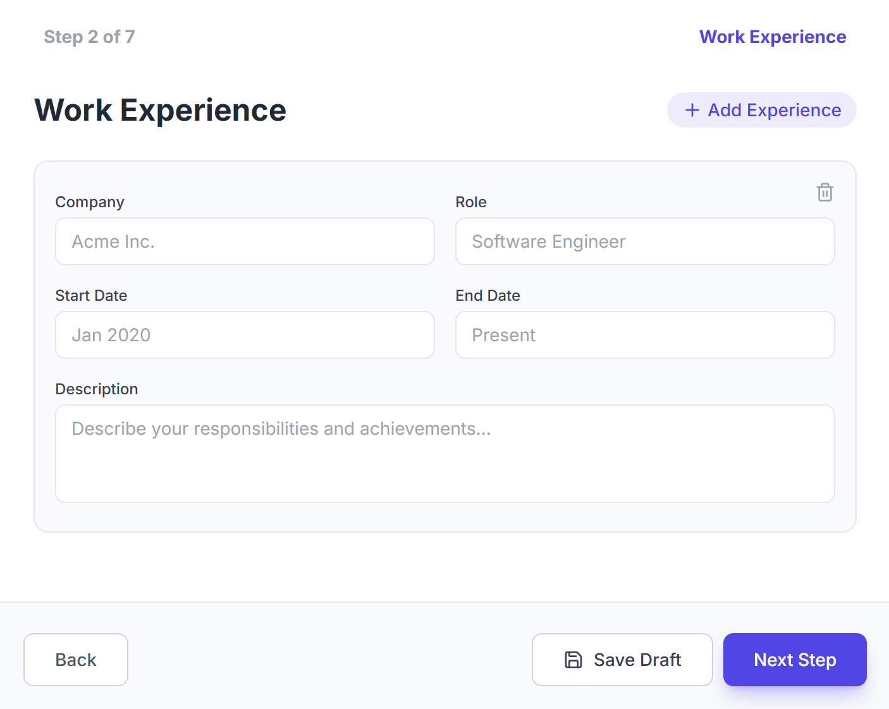
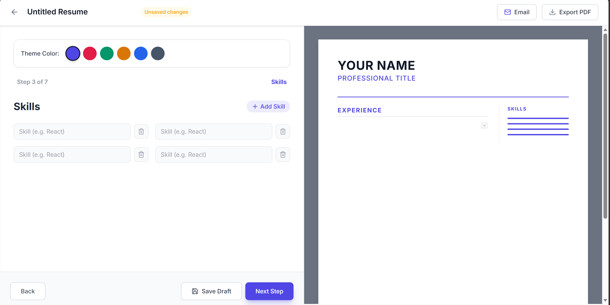
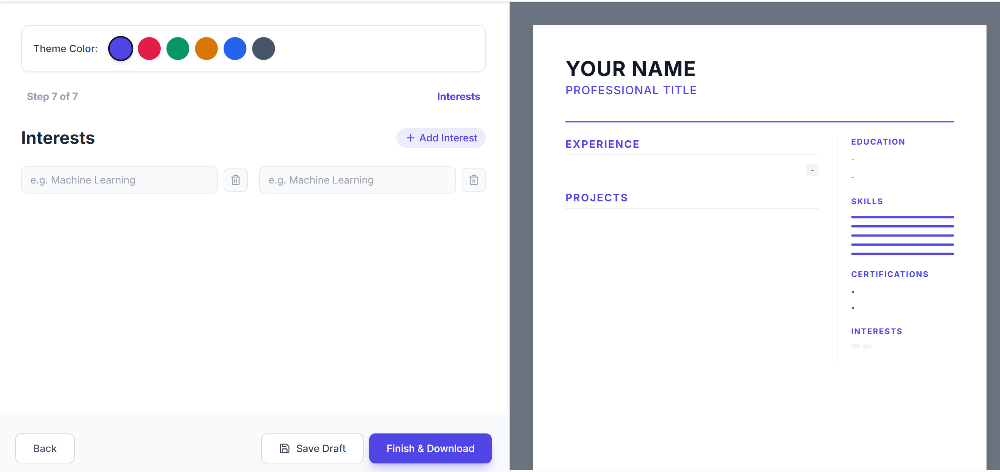
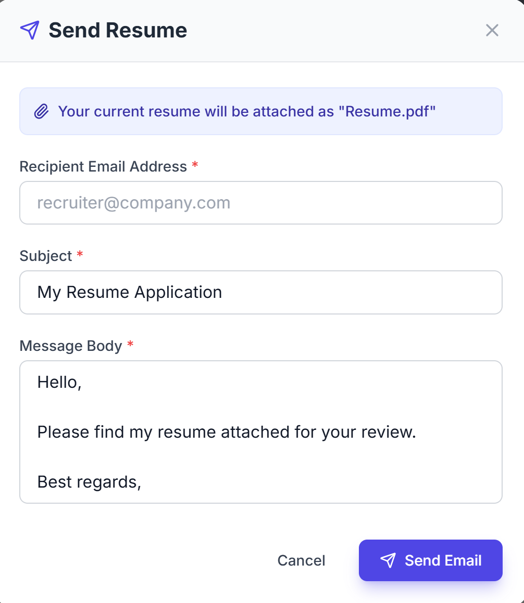

# Resume-Builder-Frontend

# Modern React frontend for AI Resume Builder with responsive design, authentication flows, form handling, and API integration for resume generation.

# React + Vite

This template provides a minimal setup to get React working in Vite with HMR and some ESLint rules.

Currently, two official plugins are available:

- [@vitejs/plugin-react](https://github.com/vitejs/vite-plugin-react/blob/main/packages/plugin-react) uses [Oxc](https://oxc.rs)
- [@vitejs/plugin-react-swc](https://github.com/vitejs/vite-plugin-react/blob/main/packages/plugin-react-swc) uses [SWC](https://swc.rs/)

## React Compiler

The React Compiler is not enabled on this template because of its impact on dev & build performances. To add it, see [this documentation](https://react.dev/learn/react-compiler/installation).

## Expanding the ESLint configuration

If you are developing a production application, we recommend using TypeScript with type-aware lint rules enabled. Check out the [TS template](https://github.com/vitejs/vite/tree/main/packages/create-vite/template-react-ts) for information on how to integrate TypeScript and [`typescript-eslint`](https://typescript-eslint.io) in your project.

# 🎨 ✅ 2. UI Improvements (Make it stand out)

## 🔹 Add these screens if not present:

- Dashboard page
- Resume preview page
- Success message after submit
- Email verification UI

## 🔹 Improve UX:

- Add loading spinner during API calls
- Add toast messages (success/error)
- Form validation (very important)

---

## 🔹 Styling (Important for recruiters)

Make sure:

- Consistent colors
- Proper spacing
- Mobile responsive

👉 Easy upgrade:

- Use Tailwind CSS OR Material UI

---

# 📸 ✅ 3. Add Screenshots (BIG IMPACT)

Add images in README:

```md
## 📸 Screenshots

### 📝 Register Page

<p align="center">
  
</p>

### 🔐 Login Page

<p align="center">
    
</p>

### Dashboard

<p align="center">
    
</p>

### 📄 Resume sections

## Section 1 - Profile

<p align="center">
    
</p>

## Section 2 - Work Experience

<p align="center">
    
</p>

## Section 3 - Skills

<p align="center">
    
</p>

## Section 4 - Projects

<p align="center">
    
</p>

## Section 5 - Education

<p align="center">
    
</p>

## Section 6 - Certifications

<p align="center">
    
</p>

## Scetion 7 - Interests

<p align="center">
    
</p>

### Email Service

<p align="center">
    
</p>
```
